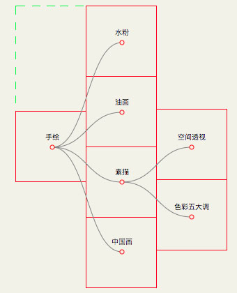

基本的树结构位置生成算法
======================

此算法是用于计算一个树结构的坐标的方法，传递配置config就可以获取树对象实例：

```js
var treeObj=tree(config);
```

config是一个键值对格式的配置json，由于原始数据格式不一定，你需要传递数据格式的配置：

- "root":function(initTree){ /*返回根结点*/ }
- "id":function(treedata){ /*返回id*/ }
- "child":function(parentTree, initTree){ /*返回孩子结点*/ }

另外，你还可以通过tree.root()、tree.id()和tree.child()方法，随时调整配置。

现在传递数据data进行计算即可：

```js
var resultData=treeObj(data);
```

resultData是计算后带有结点坐标的数据，格式如下：

```js
{node: {
    "XXX":{
        children: []
        data: any
        id: string||number
        left: number
        pid: any
        top: number
    },
    ...
}, root: string||number, size: number, deep: number}
```

node记录的是每个结点的信息，每个结点中的left和top就是该结点应该绘制的位置，data是结点的原始数据。

可能你已经发现了，树图分为很多种（圆形树，倒树等），上面并没有配置这些信息,是的，因为可能的树图无法预测，我们这里选择了一种最简单的模型，方便具体使用的时候可以在此基础上快速开发。

这是一棵从左到右，根节点位于左中心，每个节点位于一个1x1的正方形中心的单元树。



比如上图结点『油画』的数据如下：

```js
"油画":{
    children: [];
    data: (2) ["油画", "手绘"];
    id: "油画";
    left: 1.5;
    pid: "手绘";
    top: 1.5
}
```

[<< 返回首页](../README.md)
